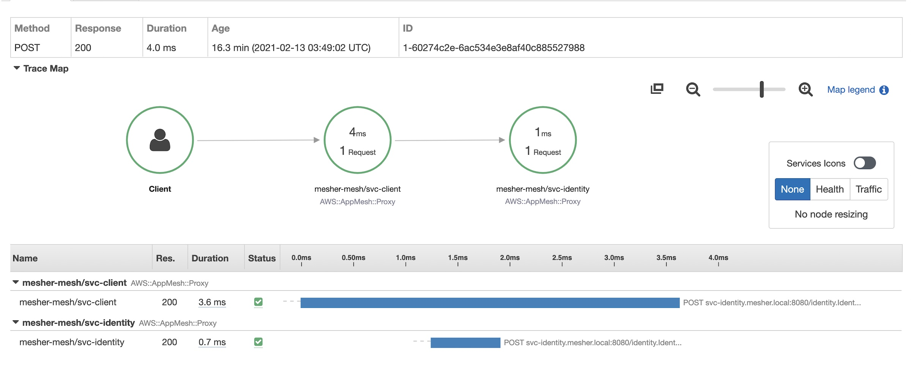

# app-mesher

A sample architecture incorporating [AWS App Mesh](https://aws.amazon.com/jp/app-mesh/?aws-app-mesh-blogs.sort-by=item.additionalFields.createdDate&aws-app-mesh-blogs.sort-order=desc&whats-new-cards.sort-by=item.additionalFields.postDateTime&whats-new-cards.sort-order=desc) as a service mesh for services that communicate via gRPC.

gRPC retries are handled by [the default App Mesh retry policy](https://docs.aws.amazon.com/app-mesh/latest/userguide/envoy.html#default-retry-policy).

<p align="center">
    
</p>

## Setup

Get started with the [/infra README file](https://github.com/Jimeux/app-mesher/tree/master/infra). 

Verify with the following request.

```bash
curl -X POST \
https://mesher.example.com/client/v1/tokens \
-d '{"username": "mesher"}'

-------
HTTP 200 
{"token":"token:mesher"}
```
View the [Service Map](https://ap-northeast-1.console.aws.amazon.com/xray/home#/service-map) on the AWS X-Ray dashboard.

## References
- Loosely based on the [howtogrpc](https://github.com/aws/aws-app-mesh-examples/tree/59e1d1a738346836bfe5bf589805a4f6fc777bd5/walkthroughs/howto-grpc)  example in the [aws-app-mesh-examples](https://github.com/aws/aws-app-mesh-examples) repository
- [AWS Cloud Containers Conference - Deep Dive on Configuring AWS App Mesh | YouTube](https://www.youtube.com/watch?v=qM4uf9l5lus)
