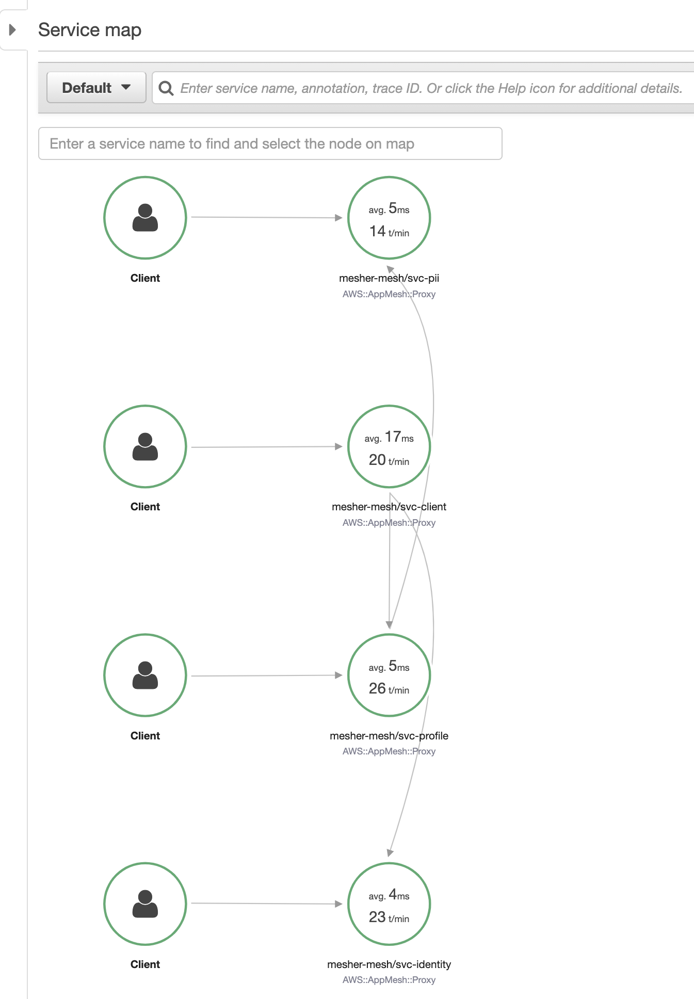

# app-mesher

A sample architecture incorporating [AWS App Mesh](https://aws.amazon.com/jp/app-mesh/?aws-app-mesh-blogs.sort-by=item.additionalFields.createdDate&aws-app-mesh-blogs.sort-order=desc&whats-new-cards.sort-by=item.additionalFields.postDateTime&whats-new-cards.sort-order=desc) as a service mesh for services that communicate via gRPC.

<p align="center">
    
</p>

## Setup

Get started with the [/infra README file](https://github.com/Jimeux/app-mesher/tree/master/infra). 

## Verify

1. Verify the API with the following request:

```bash
curl -X POST \
https://mesher.example.com/client/v1/tokens \
-d '{"id": 123, "username": "mesher"}'
```
```json
{
  "token": "token:mesher",
  "profile": "profile:123",
  "data": "data:123"
}
```

2. Verify the deployment on the AWS dashboard:
- View the [service mesh](https://ap-northeast-1.console.aws.amazon.com/appmesh/meshes) on App Mesh
- View the [service map](https://ap-northeast-1.console.aws.amazon.com/xray/home#/service-map) on X-Ray
- View the [private DNS namespace](https://ap-northeast-1.console.aws.amazon.com/cloudmap/home#namespaces) used for service discovery on Cloud Map
- View the [ECS cluster](https://ap-northeast-1.console.aws.amazon.com/ecs/home#/clusters) and services on ECS

## Next Steps

- Configure tracing
- Investigate [retry policies and circuit breaker settings](https://docs.aws.amazon.com/app-mesh/latest/userguide/envoy.html#default-retry-policy)


## References
- Loosely based on the [howtogrpc](https://github.com/aws/aws-app-mesh-examples/tree/59e1d1a738346836bfe5bf589805a4f6fc777bd5/walkthroughs/howto-grpc)  example in the [aws-app-mesh-examples](https://github.com/aws/aws-app-mesh-examples) repository
- [AWS Cloud Containers Conference - Deep Dive on Configuring AWS App Mesh | YouTube](https://www.youtube.com/watch?v=qM4uf9l5lus)
- [App Mesh documentation](https://docs.aws.amazon.com/app-mesh/)
- [Cloud Map documentation](https://docs.aws.amazon.com/cloud-map/)
- [Service Discovery | Amazon ECS Developer Guide](https://docs.aws.amazon.com/AmazonECS/latest/developerguide/service-discovery.html)
